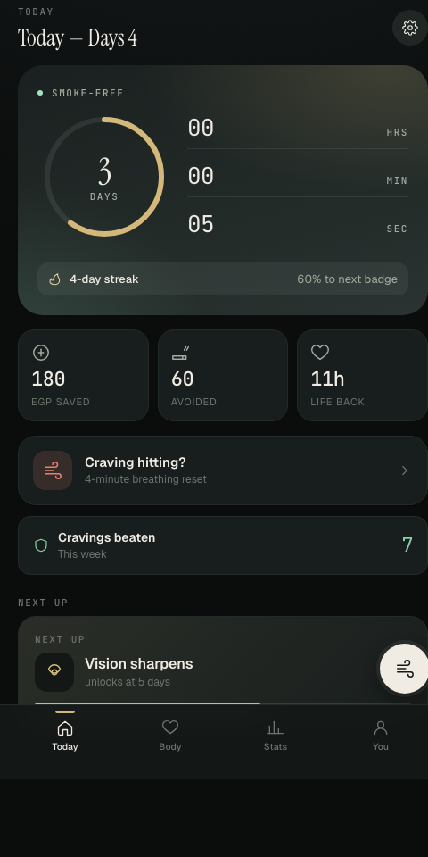
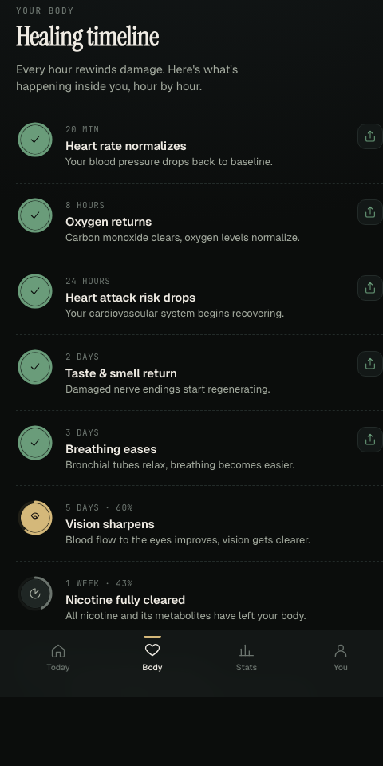
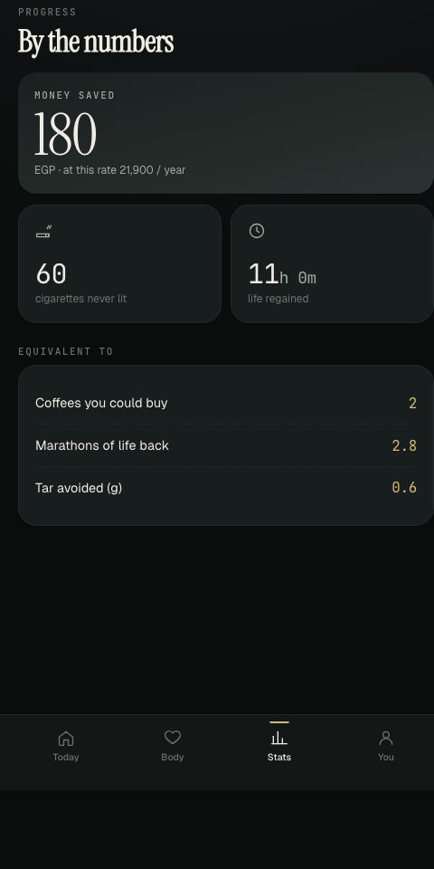
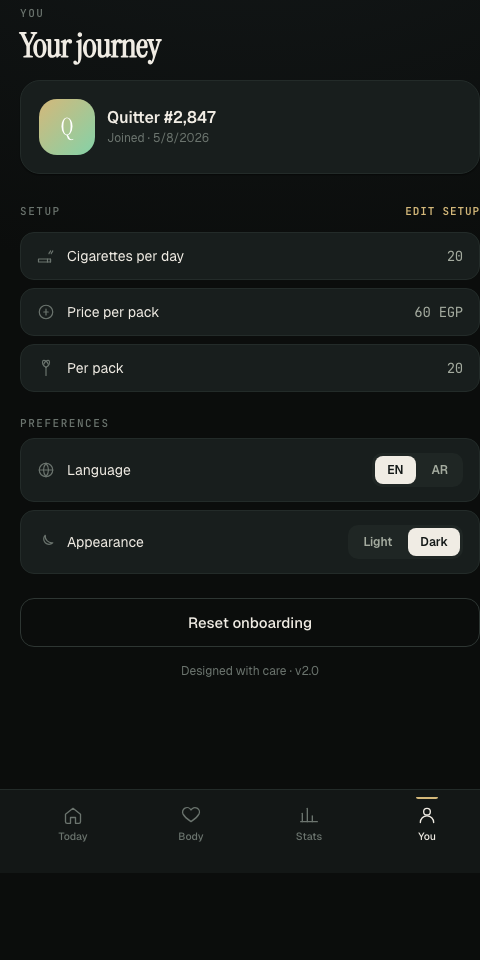
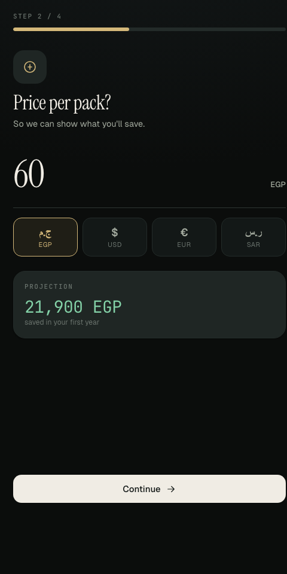

# QuitTrack

A premium-feel progressive web app to track your quit-smoking journey — live timer, money saved, health milestones with progress rings, breathing exercises for cravings, and shareable achievement medals.

🌐 **Live demo:** [quitsmokingapp.netlify.app](https://quitsmokingapp.netlify.app/)

Bilingual (English + Arabic with RTL), works offline, installs to your home screen, no account required.

---

## Screenshots

| Today | Healing timeline | Stats | You |
| --- | --- | --- | --- |
|  |  |  |  |

Onboarding lets you pick your currency (EGP, USD, EUR, SAR) — savings projections update live:



---

## Features

- **Live timer** — days, hours, minutes, seconds since you quit, with a circular progress ring toward your next milestone.
- **Healing timeline** — 19 health milestones from "20 minutes" to "10 years," each with a progress ring counting from your quit date.
- **Share achievements** — every completed milestone has a share button that opens a medal card you can post to friends.
- **Money saved + cigarettes avoided** — calculated live from your daily smoking habit, in your chosen currency (EGP / USD / EUR / SAR).
- **Craving reset** — a 4-minute guided breathing exercise with a "why you're doing this" reminder card.
- **Stats tab** — translates your savings and time-back into things you understand: coffees, marathons of life regained, grams of tar avoided.
- **Bilingual** — fully translated English and Arabic with proper right-to-left layout.
- **Light + dark themes** — warm cream + gold + forest green palette, designed to feel calm.
- **Offline-first PWA** — service worker caches everything, so it keeps working with no signal.

---

## Install on your phone

1. Open [quitsmokingapp.netlify.app](https://quitsmokingapp.netlify.app/) in Chrome (Android) or Safari (iOS).
2. Tap the browser menu → **"Add to Home Screen"** / **"Install app"**.
3. The app launches fullscreen with its own icon, like a native app.

Your data is stored locally in your browser — nothing is sent to a server, no account is required.

---

## Tech stack

- Vanilla HTML / CSS / JS — zero frameworks, zero build step
- Service worker for offline caching
- Web App Manifest for install-to-home-screen
- `localStorage` for persistence
- Web Share API for native share dialogs
- Google Fonts: Instrument Serif (display), Geist (UI), JetBrains Mono (numbers), IBM Plex Sans Arabic

---

## Run locally

```bash
git clone https://github.com/thegreatLUCY/quit-smoking-app.git
cd quit-smoking-app
python3 -m http.server 8090
```

Then open [http://localhost:8090](http://localhost:8090).

---

## Project structure

```
index.html        Main page, all screens (onboarding + 4 tabs + sheets)
styles.css        Design tokens, themes, all component styles
app.js            App logic: timer, milestones, craving sheet, share modal
i18n.js           English + Arabic translations
milestones.js     Extended milestone + achievement data
sw.js             Service worker (offline cache)
manifest.json     PWA manifest (icons, theme color, display mode)
icons/            App icons (192px, 512px)
screenshots/      README screenshots
```

---

## Deploy to Netlify

This is a static site with no build step:

- **Build command:** _(leave empty)_
- **Publish directory:** `.`

Push to `main` and Netlify rebuilds automatically.

---

Designed with care · v2.0
